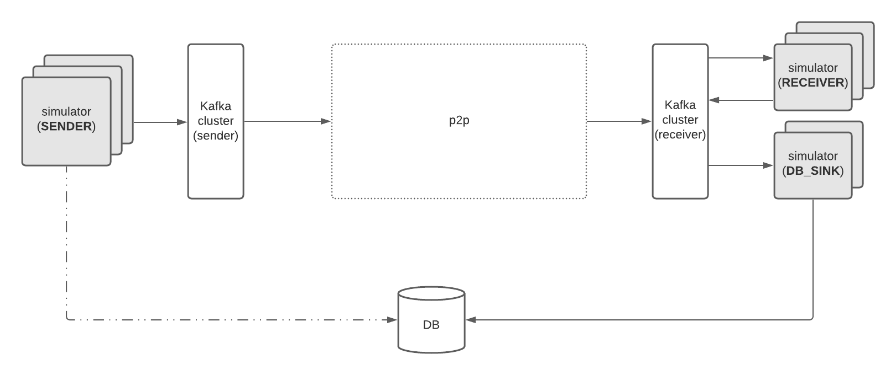

# P2P application-simulator worker

This is an application that can be used to simulate the application layer by sending/receiving messages to/from the p2p layer and writing metadata for analysis to a PostgreSQL database.

## Introduction

It can be executed in three main modes:
* `SENDER`: in this mode, the tool sends messages to the Kafka topics monitored by p2p components and (optionally) writes metadata to a postgres DB.
* `RECEIVER`: in this mode, the tool receives messages from the Kafka topics where p2p delivers them and writes them to a temporary topic along with metadata.
* `DB_SINK`: in this mode, the tool copies the metadata from Kafka into a relational database.



### Sender Mode

In this mode, the tool will generate messages to the topic, which is where the p2p layer processes them from by default (`p2p.out`).
The tool will also (optionally) write some additional metadata (e.g. message ID, sender ID) to the specified database.
Whether you want to write metadata to the DB from the sender depends on the nature of testing:
* If you want to perform functional testing, it's useful to write this metadata to the DB so that you can check whether all sent messages were delivered.
* If you want to perform performance/stress testing, you can disable this part. This will prevent the DB from becoming a bottleneck and you will still get latency statistics for the delivered messages.

In the sender mode, the configuration file should have the following form:
```
{
    dbParams: {
        username: "corda",
        password: "corda-p2p-masters",
        host: "localhost",
        db: "corda"
    },
    parallelClients: 1,
    simulatorMode: "SENDER",
    loadGenerationParams: {
        peerX500Name: "O=Alice,L=London,C=GB",
        peerGroupId: "group-1",
        ourX500Name: "O=Bob,L=London,C=GB",
        ourGroupId: "group-1",
        loadGenerationType: "CONTINUOUS",  
        // totalNumberOfMessages: 1000 - only required when loadGenerationType = ONE_OFF
        batchSize: 10,
        interBatchDelay: 0ms,
        messageSizeBytes: 10000,
        expireAfterTime: 10s
    }
}
```

The `loadGenerationType` can have two values:
* `ONE_OFF`: this is a one-off generation of load. It will generate a specific number of messages (as specified by `totalNumberOfMessages`) and then stop.
* `CONTINUOUS`: this is a continuous generation of load. It will send messages in a closed loop (i.e. send messages, wait until they are delivered to Kafka and metadata written to DB, send next batch etc.) until the application is stopped.

The following configuration options are optional:
* `dbParams`: if this option is specified, the simulator will also write some metadata for each message (e.g. message ID, sender ID) to the specified database.
* `messageSizeBytes`: this is the size of the payload for the generated messages (random data will be generated). Default: 10KB.
* `parallelClients`: this is the number of parallel clients/threads used to send messages. Default: 1. Note: each client will send `totalNumberOfMessages` individually.
* `interBatchDelay`: the delay introduced between each batch of messages. Default: no delay.
* `batchSize`: the number of messages sent in parallel on every batch. Default: 50.
* `expireAfterTime`: the time after which the message will expire. This is used to calculate the TTL of the generated messages, which corresponds to the current time plus the duration specified by `expireAfterTime`. If not specified, no TTL is added to the message. Default: not specified.

### Receiver Mode

In this mode, the tool will consume messages from the default topic where the p2p layer delivers messages (`p2p.in`).
The consumed messages will be written to a secondary topic (`app.received_msg`) along with some additional metadata (e.g. timestamps, calculated latency).
In this mode, the application will run until explicitly stopped.

In the receiver mode, the configuration file should have the following form:
```
{
    parallelClients: 1
    simulatorMode: "RECEIVER"
    topicCreationParams {
        numPartitions: 10
	replicationFactor: 3
    }
}
```

The following configuration options are optional:
* `parallelClients`: the number of parallel clients/threads consuming messages from Kafka. Default: 1.
* `numPartitions`: the number of partitions for the app.received_msg topic. Default: 10.
* `replicationFactor`: the replication factor for the app.received_msg topic. Default: 1.
### Database Sink mode

In this mode, the tool will copy all the metadata from the Kafka topic (`app.received_msg`) into the specified database for further analysis.
In this mode, the tool will run until explicitly stopped.

The configuration should have the following form:
```
{
	dbParams: {
        username: "corda",
        password: "corda-p2p-masters",
        host: "localhost",
        db: "corda"
    },
    parallelClients: 1
    simulatorMode: "DB_SINK"
}
```

The following configuration options are optional:
* `parallelClients`: the number of parallel clients/threads consuming messages from Kafka. Default: 1.

## Building the app-simulator

### Building the JAR

To build the JAR artefact, run:
```
./gradlew applications:tools:p2p-test:app-simulator:clean applications:tools:p2p-test:app-simulator:appJar
```
This will create an executable JAR in `applications/tools/p2p-test/app-simulator/build/bin/`.

### Building the Docker image

To build the Docker image, run:
```bash
./gradlew :applications:tools:p2p-test:app-simulator:publishOSGiImage
```

## Running the app-simulator

### Running the JAR
To run the JAR, use:
```
java -jar applications/tools/p2p-test/app-simulator/build/bin/corda-app-simulator*.jar --simulator-config ~/Desktop/simulator.conf
```

The simulator configuration file can differ depending on the mode, as explained above.

Below is a list of command line arguments you can use:
```bash
  -h, --help   Display help and exit
  -i, --instance-id=<instanceId>
               The instance ID. Defaults to the value of the env. variable
                 INSTANCE_ID or a random number, if that hasn't been set.
  -m, --messaging-params=<String=String>
               Messaging parameters for the simulator.
      --receive-topic=<receiveTopic>
               Topic to receive messages from. Defaults to p2p.in, if not
                 specified.
      --send-topic=<sendTopic>
               Topic to send the messages to. Defaults to p2p.out, if not
                 specified.
      --simulator-config=<simulatorConfig>
               File containing configuration parameters for simulator. Default
                 to config.conf
```
By default, the simulator will try and connect to a Kafka broker on localhost:9092.
To override this use option `-m`. For example, to connect to a Kafka Broker on `kafka-broker:1000`:
```bash
java -jar applications/tools/p2p-test/app-simulator/build/bin/corda-app-simulator*.jar -mbootstrap.servers=kafka-broker:1000
```
These -m options are passed into the Kafka client. For example to use TLS to connect to the Kafka broker the following -m options can be used:
```bash
java -jar ./applications/p2p-link-manager/build/bin/corda-p2p-link-manager*.jar -msecurity.protocol=SSL -mssl.truststore.location=/certs/ca.crt -mssl.truststore.type=PEM
```
It is possible to pass in the all the options from the command line, instead of using a config file.
The dbParams can be specified with `-d` options e.g. `-dusername=root -dpassword=securePassword` and loadGenerationParams with `-l` options e.g. `-lpeerX500Name=O=Alice,L=London,C=GB`.
The command line has precedence over the config file, if an option is specified in both places.

### Running the Docker image

To run the Docker image, run:
```bash
docker run \
  -v $(pwd)/applications/tools/p2p-test/app-simulator/SenderConfigurationExample.conf:/config.conf \
  -e KAFKA_SERVERS="broker1:9093" \
  corda-os-docker-dev.software.r3.com/corda-os-app-simulator:<version>
```

Below is a list of environment variables you can use:
* `KAFKA_SERVERS` - The list of Kafka server (default to `localhost:9092`)
* `INSTANCE_ID` - The simulator instance ID (default to random number)

## Database metadata

As mentioned before, the application can optionally write some additional metadata to a PostgreSQL database that can be used for further analysis.

### Sender mode

In this mode, when configured to write to a DB the application writes metadata to the table `sent_messages` with the following columns:
* `sender_id`: an identifier for the sender, which is unique for every run of the tool.
* `message_id`: the identifier of the message that was sent.

### DB Sink mode

In this mode, the application writes metadata to the table `received_messages` with the following columns:
* `sender_id`: the identifier of the sender of the received message.
* `message_id`: the identifier of the message that was received.
* `sent_timestamp`: a timestamp corresponding to the time the message was sent.
* `received_timestamp`: a timestamp corresponding to the time the message was received.
* `delivery_latency_ms`: the time the message took to be delivered end-to-end in milliseconds.

### Deploying the database using Docker

For convenience, this project contains a Docker compose file that can be used to start a Docker container with a postgres database containing the tables required.

In order to deploy this locally, you can use the following command:
```
docker-compose -f applications/tools/p2p-test/app-simulator/src/test/resources/postgres-docker/postgres-db.yml up -d
```

### Metadata analysis

Below are some useful SQL statements to analyse the metadata.

#### Verifying reliable delivery

After your testing is complete, you can check if there are any sent messages that weren't delivered using this query:
```
select sm.sender_id, sm.message_id
from sent_messages sm 
left join received_messages rm 
on sm.sender_id = rm.sender_id and sm.message_id = rm.message_id 
where rm.message_id is null
```

Note: in order to use this query, you must have configured the sender to produce data in the DB. Otherwise, it's going to be empty regardless of whether all messages were delivered.

#### Calculating latencies & aggregate statistics

In order to calculate the latency of the delivered messages (in ms) aggregated in 30-second time windows, you can run the following query:
```
select 
	to_timestamp(floor((extract('epoch' from rm.sent_timestamp) / 30 )) * 30) at time zone 'utc' as time_window,
	count(rm.delivery_latency_ms) as total_messages,
	max(rm.delivery_latency_ms) as max_latency,
	min(rm.delivery_latency_ms) as min_latency,
	avg(rm.delivery_latency_ms) as average_latency,
	percentile_disc(0.99) within group (order by rm.delivery_latency_ms) as p99_latency
from received_messages rm 
group by time_window
order by time_window asc
```

If you want to calculate latencies only for a specific sender, you can add a `where sender_id = '<your-sender-id>'` clause (replace `<sender-id>` with the right value).

## Deploying in k8s using helm charts.

The `charts` subfolder contains helm charts that can be used to deploy the required PostgreSQL database and app-simulator instances.

## Download dependencies

Before using these helm charts for the first time, ensure that all unique repositories declared in `charts/app-simulator-db` have been added via `help repo add <repo>`. To find these repos, you can run:
```shell
helm dep ls charts/app-simulator-db | awk 'NR>1 && NF > 1' | cut -f 3 | sort -u
```

To download these to the required directory, execute the following command:
```shell
helm dep build charts/app-simulator-db
```

## App-simulator DB helm charts

The `app-simulator-db` chart contains a deployment of a postgreSQL database, which can be used by multiple app-simulator instances.

To install the helm chart with the default values, run the following command:
```shell
helm upgrade -i "<RELEASE NAME>" charts/app-simulator-db --namespace "<RELEASE NAMESPACE>" --create-namespace --timeout 10m --wait
```
Optionally use the `--render-subchart-notes` for a brief overview of all connection details.

### Execute test hook
After the release has been installed, it may be tested via the following command:
```shell
helm test "<RELEASE NAME>" -n "<RELEASE NAMESPACE>"
```

### Externalise services

As an alternative to port-forwarding services for accessing them outside the cluster, a non-default `values-external.yaml` has been crafted - intended to enrich the default parameters to expose postgreSQL via a NodePort service.

It can be used by appending the following option to the `helm upgrade` command:
```shell
--values charts/app-simulator-db/values-external.yaml
```
The node port used is 30200.

## Maintaining

As new value fields are added to the default `values.yaml`, doc strings should be included.

For objects prefer this style:
```yaml
# Doc string on an object, which won't show in README.md
foo: {}
```

Whereas for primitive types prefer this style:
```yaml
# -- Doc string for a primitive, which will show in the README.md
foo: "bar"
```

Then using [helm-docs](https://github.com/norwoodj/helm-docs), generate the README.md via:
```shell
helm-docs
```
