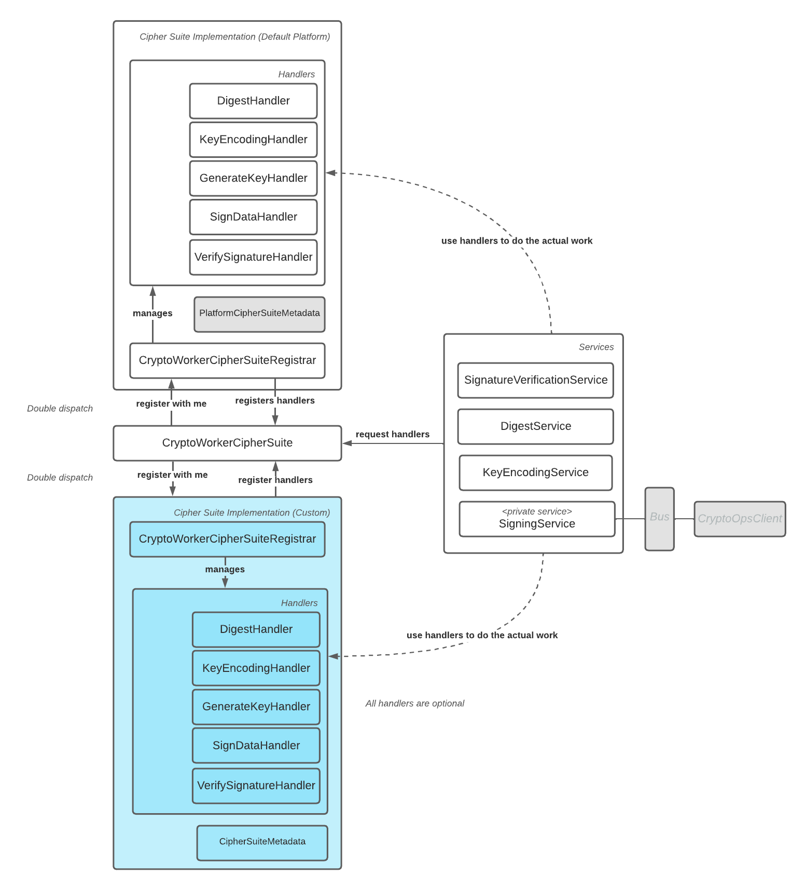

# Overview

The main idea is that instead of services which should be overridden the new solution suggest to define a notion of handlers
where each handler will be responsible for tightly related operations - such as verification, digests, key generation, 
signing, and key serialisation.

The services will use those handlers to perform the service functions.

There are two types of the cipher suite itself:
* For crypto worker
* In-process for all other workers if they need the crypto operations 

The in-process cipher-suite will look similar but with the subset of the handlers and services as well as nothing in
that site will have the lifecycle.

That's the overview based on the crypto worker cipher suite:

# Implementation Notes

In some places there is need to separate implementation in modules for:
* in-process components (one of which is PlatformCipherSuiteRegistrar and similar)
* crypto worker specific (one of which is PlatformCryptoWorkerCipherSuiteRegistrar and similar)

Note that except the PlatformCipherSuiteRegistrar itself the rest of the in-process components 
can be used inside the crypto worker