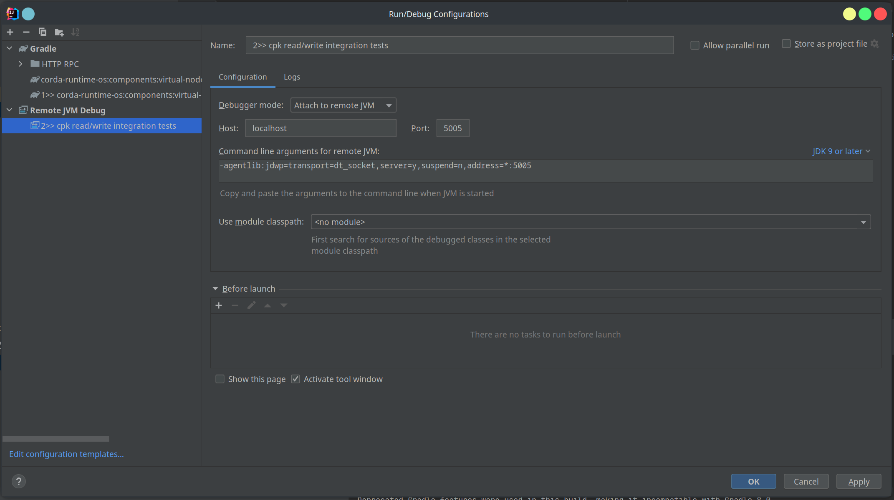

# CPK Read Service

For a given identifier get the CPK from some unspecified backing storage.

## Integration tests

To run this set of integration tests (and others), locate and run both 
the `clean` and `integrationTest` tasks:

Then edit the `integrationTest` configuration to run the `clean` task before launch,
and append `-D-runjdb=5005`:

Next, create a "Remote JVM Debug" configuration, ensuring the port matches the one used
previously, i.e. `5005`

Run the `integrationTest` task, once it starts, it will pause and wait.

Finally, run the `Remote JVM Debug` task to connect, and you can debug into the
integration test.
