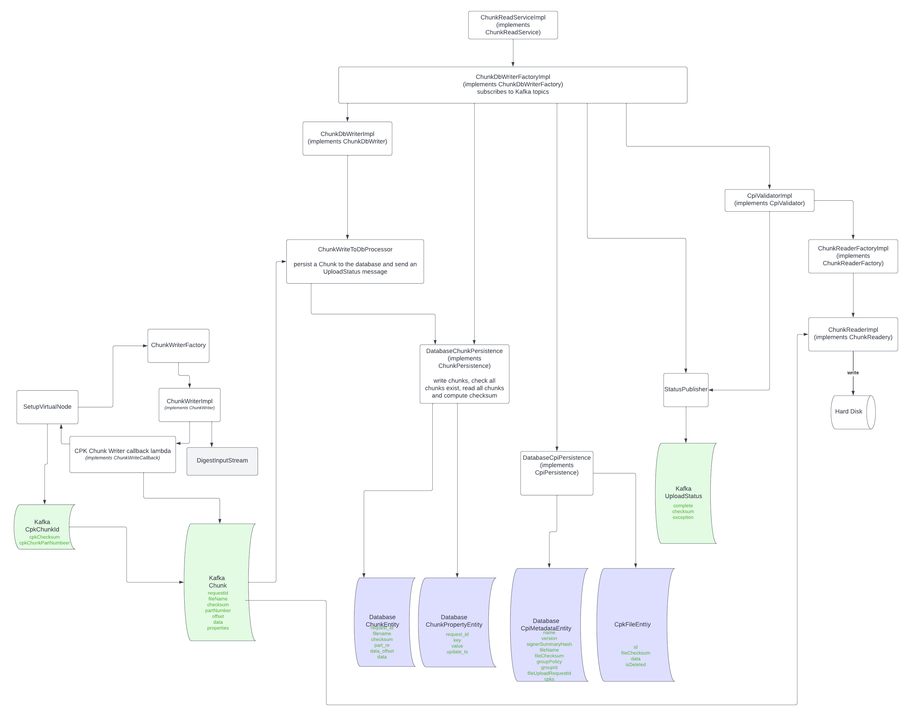

# Binary Chunking

# Code structure


([Lucid.app editable version](https://lucid.app/lucidchart/354578f9-4f00-4318-b93a-b4453357327d/edit?viewport_loc=-830%2C-1743%2C4363%2C3311%2C0_0&invitationId=inv_bcf8d6e1-8249-48e0-97ab-86b2e6e8dbbb#))

# Summary

This library converts a binary into chunks and puts them into an Avro
[`Chunk`](https://github.com/corda/corda-api/blob/release/os/5.0/data/avro-schema/src/main/resources/avro/net/corda/data/chunking/Chunk.avsc)

The algorithm is simple and similar to Chunked Transfer Coding
[RFC7230](https://datatracker.ietf.org/doc/html/rfc7230#page-36) in that we:

* send a payload of bytes
* we can get the size of the payload from its type
* we send a zero sized payload in a `Chunk` to denote the final chunk

The key structure in the chunking implementation can be seen in the Avro schema, but is essentially:

```kotlin
class Chunk {
    val requestId: String
    val checksum
    val partNumber: Int // chunk number - zero indexed
    val data: ByteBuffer  // chunk payload and size via limit()
    val offset:  Long // offset of this chunk from 0            
}
```

As we read the binary from a stream, we build the message digest (checksum) on the
fly, and it is only available for sending once we have read all the data from the stream.

The checksum for the binary is therefore in the final (zero-sized) chunk. 

## Write (i.e. putting a large binary object into Kafka)

Currently chunking is initiated only by  [SetupVirtualNode](../../applications/tools/flow-worker-setup/src/main/kotlin/net/corda/applications/setup/tasks/SetupVirtualNode.kt) when a CPI is to be made available for setting up a virtual node.
This code is concerned with both specifics of Corda CPIs and virtual nodes, and with
chunking large binaries to fit them across Kafka with its message size limit. The code loops over 
all CPI files and for each one passes a byte stream to 
[ChunkWriterFactory](chunking-core/src/main/kotlin/net/corda/chunking/impl/ChunkWriterImpl) which divides the blob into Chunk records
and calls back into [SetupVirtualNode](../../applications/tools/flow-worker-setup/src/main/kotlin/net/corda/applications/setup/tasks/SetupVirtualNode.kt), which
publishes everything to Kafka's CPK_FILE_TOPIC. The secure hash of the CPIs is also computed while streaming out
the CPI content to form the Kafka Chunk messages by using DigestinputStream.


The ["write" algorithm](https://github.com/corda/corda-runtime-os/blob/89b29448165e91576682d65e9ee4b205fedc071e/libs/chunking/src/main/kotlin/net/corda/chunking/impl/ChunkWriterImpl.kt#L47) is:

```
offset = 0
while (true)
    bytes = readBytesFromStream(stream, maxBytesToRead)
    if (end of stream is reached) break
    write( chunk(offset, bytes) )
    offset = offset + number of bytes read
end-while 

write( chunk(offset, null) )
```

## Read

### Out-of-order

The ["read" algorithm](https://github.com/corda/corda-runtime-os/blob/89b29448165e91576682d65e9ee4b205fedc071e/libs/chunking/src/main/kotlin/net/corda/chunking/impl/ChunkReaderImpl.kt#L35)
writes the chunks to a file at the _specified offset_ in the `Chunk`.  This allows us to write out of order chunks 
to a file in the case of reordering.

The "read" is complete when we have received a zero-sized chunk and the number of chunks received are equal to 
the zero-sized chunk's `partNumber + 1`. 

We additionally check the checksum (in the zero-sized chunk) against what we have written to file.

The checksum for the binary (not the individual chunks) is in the final (zero-sized) chunk.

Out of order chunks need to be written to either file, or to some in-memory buffer of sufficient size.

### In-order

If we can guarantee that the chunks arrive in order, we can simply stream them, _in order_ one after the other until 
we reach the zero-sized chunk, and stop.

In the minimal case of passing the received chunks directly to a (buffered?) output stream, we cannot validate
the data received over the stream via a checksum until we have processed the entire stream, i.e. received
all the chunks.

# Future development

Perhaps we should split out chunking to run as a layer between Corda and Kafka, which only deals with chunking large binaries (BLOBs).
Such a layer would:

- handle segmentation and reassembly of large binary objects
- assume Kafka will reliably transport messages, but not preserve order
- support streaming on both transmission and reception sid
