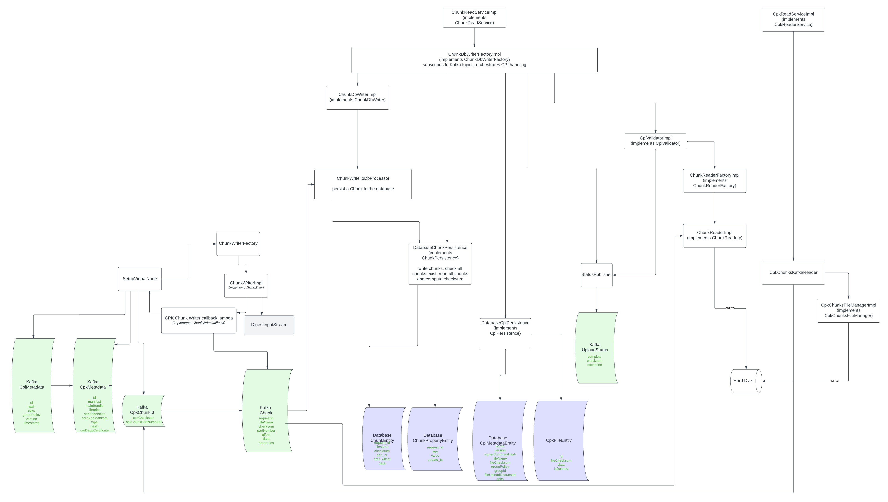

# Binary Chunking

# Code structure


([Lucid.app editable version](https://lucid.app/lucidchart/354578f9-4f00-4318-b93a-b4453357327d/edit?viewport_loc=-830%2C-1743%2C4363%2C3311%2C0_0&invitationId=inv_bcf8d6e1-8249-48e0-97ab-86b2e6e8dbbb#))

# Summary

This library converts a binary into chunks and puts them into an Avro
[`Chunk`](https://github.com/corda/corda-api/blob/release/os/5.0/data/avro-schema/src/main/resources/avro/net/corda/data/chunking/Chunk.avsc)

The algorithm is simple and similar to Chunked Transfer Coding
[RFC7230](https://datatracker.ietf.org/doc/html/rfc7230#page-36) in that we:

* send a payload of bytes
* we can get the size of the payload from its type
* we send a zero sized payload in a `Chunk` to denote the final chunk

The key structure in the chunking implementation can be seen in the Avro schema, but is essentially:

```kotlin
class Chunk {
    val requestId: String
    val checksum
    val partNumber: Int // chunk number - zero indexed
    val data: ByteBuffer  // chunk payload and size via limit()
    val offset:  Long // offset of this chunk from 0            
}
```

As we read the binary from a stream, we build the message digest (checksum) on the
fly, and it is only available for sending once we have read all the data from the stream.

The checksum for the binary is therefore in the final (zero-sized) chunk. 

## Write (i.e. transmitting a large binary object via Kafka)

Currently, chunking is initiated only by  [SetupVirtualNode](../../applications/tools/flow-worker-setup/src/main/kotlin/net/corda/applications/setup/tasks/SetupVirtualNode.kt) 
when a CPI is to be made available for setting up a virtual node. This code is concerned with both specifics of 
Corda CPIs and virtual nodes, and with chunking large binaries to fit them across Kafka with its message size limit.
The code loops over all CPI files and for each one passes a byte stream to 
[ChunkWriterFactory](chunking-core/src/main/kotlin/net/corda/chunking/impl/ChunkWriterImpl) which divides the blob into 
Chunk records and calls back into [SetupVirtualNode](../../applications/tools/flow-worker-setup/src/main/kotlin/net/corda/applications/setup/tasks/SetupVirtualNode.kt),
which publishes everything to Kafka's CPK_FILE_TOPIC. The secure hash of the CPIs is also computed while streaming out
the CPI content to form the Kafka Chunk messages by using DigestinputStream.


The ["write" algorithm](https://github.com/corda/corda-runtime-os/blob/89b29448165e91576682d65e9ee4b205fedc071e/libs/chunking/src/main/kotlin/net/corda/chunking/impl/ChunkWriterImpl.kt#L47) is:

```
offset = 0
while (true)
    bytes = readBytesFromStream(stream, maxBytesToRead)
    if (end of stream is reached) break
    write( chunk(offset, bytes) )
    offset = offset + number of bytes read
end-while 

write( chunk(offset, null) )
```

## Read (i.e. receive large binary artifacts from Kafka)

There are two separate services that read from the Kafka CPK_FILE_TOPIC.

1. [ChunkReadServiceImpl](../../components/chunking/chunk-read-service-impl/src/main/kotlin/net/corda/chunking/read/impl/ChunkReadServiceImpl.kt) 
  which:
   1. writes chunks to a database
   2. once all chunks have been received, writes out the CPK files to disk on to a temporary path.
   3. reassembles the CPI
   4. validates the CPI, comprising some CPKs and metadata
   5. optionally verifies the CPI signing
   6. writes the CPKs to disk
   7. checks group ID on the CPI is unique and is in the database
   8. extracts liquibase migration scripts
   10. checks database upsert on CPI record is possible
   11. sends UploadStatus messages back so the sender can tell what is going on
2. [CpkReadServiceImpl](../../components/virtual-node/cpk-read-service-impl/src/main/kotlin/net/corda/cpk/read/impl/CpkReadServiceImpl.kt]
   which:
    1. makes a compacted subscription to CPK_FILE_TOPIC
    2. writes CPKs to a CPK cache directory
    3. maintains a mapping of fully assembled CPK secure hashes to CPK metadata
    4. exposes a `get` operation which returns `Cpk` objects given a secure hash  

`ChunkReadService` is not called by anything; it only reacts to chunks and other messages coming in.
`CpiReadService`  is used in various places, in production primarily `SandboxGroupContextService` which creates a node.

### Out-of-order

The ["read" algorithm](https://github.com/corda/corda-runtime-os/blob/89b29448165e91576682d65e9ee4b205fedc071e/libs/chunking/src/main/kotlin/net/corda/chunking/impl/ChunkReaderImpl.kt#L35)

writes the chunks to a file at the _specified offset_ in the `Chunk`.  This allows us to write out of order chunks 
to a file in the case of reordering.

The "read" is complete when we have received a zero-sized chunk and the number of chunks received are equal to 
the zero-sized chunk's `partNumber + 1`. 

We additionally check the checksum (in the zero-sized chunk) against what we have written to file.

The checksum for the binary (not the individual chunks) is in the final (zero-sized) chunk.

Out of order chunks need to be written to either file, or to some in-memory buffer of sufficient size.

### In-order

If we can guarantee that the chunks arrive in order, we can simply stream them, _in order_ one after the other until 
we reach the zero-sized chunk, and stop.

In the minimal case of passing the received chunks directly to a (buffered?) output stream, we cannot validate
the data received over the stream via a checksum until we have processed the entire stream, i.e. received
all the chunks.

# Future development - chunking refactoring?

The current chunking implementation is concerned with both chunking and CPKs. For instance,
the chunks are keyed with an ID which is the secure hash of individual CPKs within a CPI,
there are two separate services which read the chunks. Also, the chunk records include filename
and CPI properties.

Perhaps we should split out chunking to work as a library, which would be generalised to allow transferring arbitrary 
binary artifacts (BLOBs), keyed with records that include the secure hash of the whole BLOB. 

All knowledge of the use of the chunking layer for CPI/CPK content would be moved out to 
code that sits above such a pure chunking layer. Our chunking implementation could potentially be developed to 
become a standalone library which could be used outside Corda, in order to keep it clean and 
focussed, though that wouldn't necessarily be an immediate priority.

Such a pure chunking library would in due course:

1. handle segmentation and reassembly of large binary objects 
2. assume Kafka (or some other message bus beneath Corda) will reliably transport messages, but not preserve order
3. support streaming on both transmission and reception side, i.e. cope with BLOBs that are larger than RAM availabe 
4. support chunk reassembly with and without a database. Currently not all execution environments that may reuire
  chunk reassembly have a database available, e.g. the flow worker. That leaves on-disk and in-memory reassmbely, 
  which is not always desirable since the memory requirements could be prohibitive and it increases the chances of a 
  chunked message having to be retransmitted. 

The refactoring would preserve the architectural choice of Corda that it should be possible at any point to restart
workers having lost all Kafka messages, without corruption and unnecessary repetition. 

(An earlier draft of this proposal considered implementing chunking in a layer that wrapped Kafka, so the
chunked messages would not be keyed in the way that is normally done for Corda. However, after further review,
there's no need for such irregularity in the Corda design).

The current references to CPKs on the transmission side would be removed, and there would a single service
in the DB worker consuming Kafka chunk messages. We will make use of the CPK secure hashes Instead, we would
rely on the CPK secure hashes in the CPI message

`CpkChunkId` messages would disappear.

Zero sized messages to mark the end of chunks series would be discarded; that approach is problematic with Kafka's
potential message reordering.
