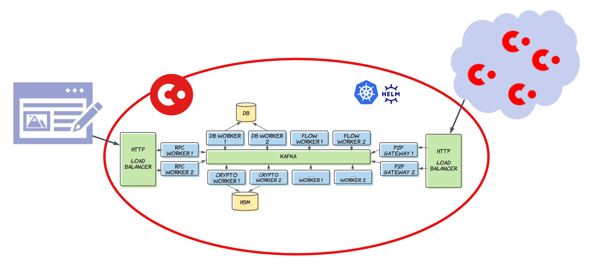
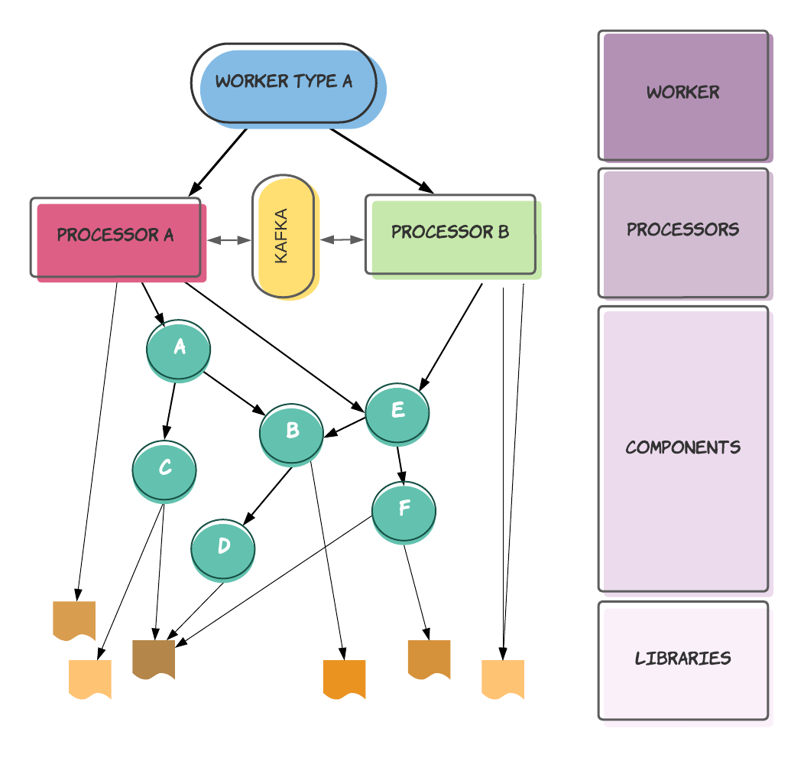

# Corda 5 Introduction

Corda 5 marks a big shift in the architecture of Corda from previous versions. This new version of Corda aims to distill the previous Corda API down to the most important parts, while also enhancing non-functional requirements such as high availability. Additionally, this new version of Corda is designed as a cloud native application. As a result Corda, has been rewritten from the ground up. This section contains an overview of the new architecture and codebase.

# Architecture

Corda 5 uses a microservices-like architecture where the overall solution is split into multiple processes called workers. Each worker is responsible for a different area of functionality. For example, the flow worker is responsible for executing CorDapp flow code. Workers communicate via a message bus which, for highly available and scalable deployments, is Kafka. Each worker is packaged up in a container, which can then be orchestrated using Kubernetes. Workers can be horizontally scaled and, by spinning up multiple instances of workers, high availability can be achieved.

The key workers in the system are:

- Flow worker
- RPC worker
- DB worker
- Crypto worker

# API

Corda 5 includes a revamp of the Corda API, streamlining some of the harder to use aspects of previous versions of Corda and layering the API to make it clearer what belongs where. This includes a more definitive split between the application API (used to define flows) and the ledger API (used to define transactions, contracts, and states). There are also clearer splits further down the stack, for example in the crypto definitions and network model.

# CorDapp packaging

In Corda 5, CorDapps are provided as a layered package. At the lowest level, a Corda Package (CPK) represents a single code entity authored by a CorDapp developer. For example, a library of flows to perform some task. A Corda Package Bundle (CPB) can be built using a collection of these packages, which represents a full application. Finally, information about the network can be added to a CPB to create a Corda Package Installer (CPI) file. When this is installed into the system, the cluster knows that any entity using this file must join the relevant network, and so can handle network onboarding accordingly.

# Network model

Networks in Corda 5 are application networks, where all participants are running the same CorDapp (CPI). Network registration and member distribution is handled by a membership group manager (MGM). Clusters can support members on multiple networks thanks to multi-tenancy support. See [Multi-tenancy and virtual nodes](#multi-tenancy-and-virtual-nodes) for more information.

# Multi-tenancy and virtual nodes

Corda 5 supports multiple network-level identities operating in the same cluster via virtual nodes. A virtual node is linked to a CPI and acts as a single member in a network once registration has been completed. The Corda 5 cluster allocates resources on a per-virtual node basis and ensures that code executing in the context of a particular virtual node is sandboxed away from other virtual nodes and platform code.

# Code structure

The code in the runtime-os repository is organised into four main folders: 
* [applications](##Applications)
* [processors](##Processors)
* [components](##Components)
* [libs](##Libs)

## Libs

Libs is the lowest-level folder. Modules in this folder should represent reusable code units, foundational pieces of the Corda 5 runtime, or units of self-contained functionality for use by some component. Libraries should contain no complex lifecycle, as lifecycle management is handled by components. However, libraries can expose a simple start/stop, as is done in the messaging library, for example.

Key libraries are:

- `libs:messaging` — contains the API and implementation for interacting with the underlying message bus. Almost all components use the messaging library in some capacity, either to read data from the bus or to communicate with some other component in some other worker.
- `libs:lifecycle` — contains the API and implementation for lifecycle management. All components use this to manage their lifecycle during start up and shut down and to respond to events in the system while it is running.
- `libs:configuration` — contains primitives for working with configuration.

Other libraries tend to be targeted towards specific pieces of functionality. For example, those in `libs:flows` handle certain aspects of the flow processor implementation.

## Components

Components contain the bulk of the code that implements the Corda 5 runtime. Components are units of functionality that make up Corda and manage their own lifecycle. A collection of components may be used to implement a feature. For example, the execution of flows is primarily implemented by `components:flow:flow-service` but it is also supported by:
* `components:flow:flow-mapper-service` 
* `components:flow:flow-rpcops-service` — implements RPC operations for interacting with flows.

Components are designed to be composable to make up a process. This makes it possible to build workers with different levels of functionality built-in. For example, an all-in-one worker can be created that contains everything for very simple deployments (e.g. local dev testing).

Components may depend on each other to meet their lifecycle requirements. For example, many components require configuration and so cannot mark themselves as ready until the configuration read service is up and has delivered some initial configuration. These relationships should be encapsulated in the component lifecycle logic.

## Processors

Processors are groupings of components that make up an area of functionality. For a full deployment, each processor is built into its own application. For example, the flow worker contains just the flow processor as a top-level object started by the application. The processor is responsible for triggering start-up logic when it is instantiated and reporting on the current health of the components underneath it.

Multiple processors could be bundled together to make a single application. For example, the all-in-one worker.

## Applications

Applications define the packaging requirements for individual processes. Typically they include one or more processors. They also declare what library implementations should be pulled in where there is a choice to be made (for example with messaging).

The main difference between applications and processors is in the build process. An application build should result in an executable of some form (which might be a container), whereas a processor build outputs a non-executable JAR.
