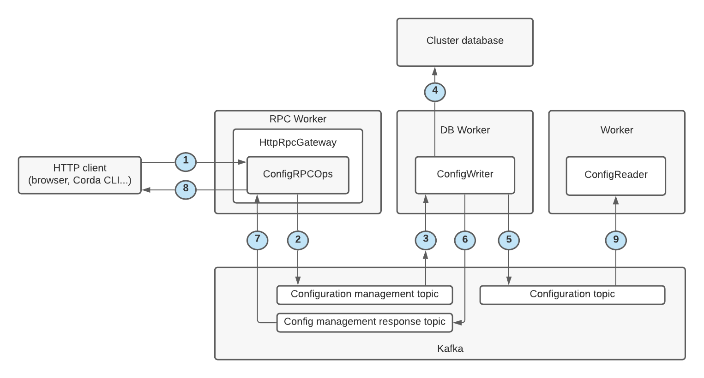

# Overview

Corda makes use of the [typesafe config](https://github.com/lightbend/config) configuration library. We extend
it with a notion of secret configuration values, where secret management can be implemented by a range of
different secrets service backends. This repository provides one implementation of the secrets service
that stores encrypted secrets, and external addons may be loaded via OSGi which for instance could read andw
write to external secrets stores.

`SmartConfig` inherits the basic approach of typesafe config, which is to take data sources (e.g. JSON files) at
run time, and provide convenient access functions which throw exceptions if the requested configuration is
missing, or has the wrong type. This makes it concise and convenient to pass around `SmartConfig` instances and
look up data on them where needed, without needing explicit type conversion or error checking code. This approach
to configuration is dynamic; neither the IDE nor the compiler can tell if the wrong name or type is used. It
feels more like Python than Java.

Corda is dynamic enough that the configuration needs to be dynamic as well. For instance, in some situations,
Corda can create new database credentials which we store in the configuration system. So as well as external
sources of configuration, we also write configuration records to Kafka so that they can be passed around multiple
instances of a Corda worker.

Corda configuration follows a
[JSON schema in cordapi.git/data/config-schema](https://github.com/corda/corda-api/tree/release/os/5.0/data/config-schema)
.
Compliance with the schema is checked defaults filled in based on the defaults for each field in the schema.


The following diagram shows the end-to-end process for creating or updating the configuration of a Corda cluster.



A cluster configuration is updated as follows:

1. An HTTP client sends an HTTP request to the RPC worker to update the cluster configuration.
2. The RPC worker validates the configuration against the JSON schema for the config section. If validation fails an error is returned to the client.
3. The RPC worker writes a configuration management request to the configuration management topic on the Kafka bus.
4. The DB worker reads the configuration management request from the configuration management topic on the Kafka bus.
5. The DB worker validates the config against the JSON schema for the config section. If validation fails an error is returned to the RPC worker via the RPC response topic.
6. The DB worker updates the configuration tables in the cluster database (no defaults applied).
7. The DB worker applies default values for the config based on the JSON schema definition for the config section.
8. The DB worker writes the updated configuration with defaults applied to the configuration topic on the Kafka bus.
9. The DB worker writes a success response to the configuration management response topic on the Kafka bus.
10. The RPC worker reads the response from the configuration management response topic on the Kafka bus.
11. The RPC worker notifies the HTTP client of the success of their request.
12. Workers are notified of the new or updated configuration from the configuration topic on the Kafka bus using the
   configuration read service.

The process uses three separate Kafka topics:

* Configuration management topic — holds _requests_ to modify the current state of the cluster configuration.
* Configuration management response topic — holds responses to requests made on the topic above.
* Configuration topic — a compacted topic that holds the current state of the cluster configuration.

The sections below describe this process in more detail. 

# HTTP requests for configuration updates

The RPC worker exposes an HTTP interface for managing cluster configuration. The endpoints for this interface are
defined by the `ConfigRPCOps` interface, as implemented by the `ConfigRPCOpsImpl` interface. The `HttpRpcGateway`
component discovers this implementation class at worker start-up and automatically serves its endpoints.

There is a single endpoint for configuration management:

`/api/v1/config`

Requests to this endpoint are expected to take the form of POST requests with the following body:

```
{
    "request": {
        "section": "configSection",
        "config": " \"key1\"=val1 \n \"key2\"=val2",
        "schemaVersion": {
            "major": 1,
            "minor": 0
         },
        "version": -1
    }
}
```
e.g
```
{
  "request": {
    "config": "session { \"messageResendWindow\" = 500 }",
	"schemaVersion": {
      "major": 1,
      "minor": 0
    },    "section": "corda.flow",
    "version": -1
  }
}
```

Where:

* `section` — the section of the configuration to be updated.
* `config` — the updated configuration in JSON or HOCON format.
* `schemaVersion` — the schema version of the configuration.
* `version` — the version number used for optimistic locking. The request fails if this version does not match the version stored in the database for the corresponding section or -1 if this is a new section for which no configuration has yet been stored.

These requests are automatically mapped to `HTTPUpdateConfigRequest` objects for handling by `ConfigRPCOpsImpl`.

Successful requests will receive a response with a success code (_2xx_) that contains the updated configuration in JSON format. For example:

```
{
    "section": "configSection",
    "config": " \"key1\"=val1 \n \"key2\"=val2",
    "schemaVersion": {
            "major": 1,
            "minor": 0
     },
    "version": 0
}
```

While unsuccessful requests are indicated by an error code (_4xx_ or _5xx_).

These responses are automatically mapped from `HTTPUpdateConfigResponse` objects.

# Publication of configuration update requests by the RPC worker

`ConfigRPCOpsImpl` holds a reference to a running
`RPCSender<ConfigurationManagementRequest, ConfigurationManagementResponse>`. For each incoming HTTP configuration
update request to the RPC worker, the connection is held open and the RPC sender is used to publish a message to
the `config.management.request` Kafka topic. This message uses the `ConfigurationManagementRequest` Avro schema:

```
{
  "type": "record",
  "name": "ConfigurationManagementRequest",
  "namespace": "net.corda.data.config",
  "fields": [
    {
      "name": "section",
      "type": "string",
      "doc": "Section of the configuration to update."
    },
    {
      "name": "config",
      "type": "string",
      "doc": "Updated configuration in JSON or HOCON format."
    },
    {
      "name": "schemaVersion",
      "type": "net.corda.data.config.ConfigurationSchemaVersion",
      "doc": "Schema version of the updated configuration."
    },
    {
      "name": "updateActor",
      "type": "string",
      "doc": "ID of RPC user that requested the configuration update."
    },
    {
      "name": "version",
      "type": "int",
      "doc": "Version of the configuration for optimistic locking."
    }
  ]
}
```

The RPC worker than awaits a response on the `config.management.request.resp` topic. This message uses the
`ConfigurationManagementResponse` Avro schema:

```
{
  "type": "record",
  "name": "ConfigurationManagementResponse",
  "namespace": "net.corda.data.config",
  "fields": [
    {
      "name": "success",
      "type": "boolean",
      "doc": "Whether the request was successful."
    },
    {
      "name": "exception",
      "type": [
        "null",
        "net.corda.data.ExceptionEnvelope"
      ],
      "doc": "The cause of failure if the request was unsuccessful."
    },
    {
      "name": "section",
      "type": "string",
      "doc": "The configuration section for which an update was requested."
    },
    {
      "name": "config",
      "type": "string",
      "doc": "The current configuration in JSON format for the given section."
    },
    {
      "name": "schemaVersion",
      "type": "net.corda.data.config.ConfigurationSchemaVersion",
      "doc": "The current configuration's schema version for the given section."
    },
    {
      "name": "version",
      "type": "int",
      "doc": "The current configuration's optimistic-locking version for the given section."
    }
  ]
}
```

If the `success` field is `true`, the configuration update request was successful and a success HTTP response is sent
to the HTTP client. Otherwise, a failure HTTP response is sent, based on the error type and error message in the
`exception` field.

The HTTP connection is then closed.

# Persistence of configuration updates by the DB worker

The DB worker uses two tables in the cluster database to manage configuration, `config` and `configAudit`. These tables
are created using the following Liquibase scripts:

```
<createTable tableName="config" schemaName="${schema.name}">
    <column name="section" type="VARCHAR(255)">
        <constraints nullable="false"/>
    </column>
    <column name="config" type="TEXT">
        <constraints nullable="false"/>
    </column>
    <column name="schema_version_major" type="INT">
        <constraints nullable="false"/>
    </column>
    <column name="schema_version_minor" type="INT">
        <constraints nullable="false"/>
    </column>
    <column name="update_ts" type="DATETIME">
        <constraints nullable="false"/>
    </column>
    <column name="update_actor" type="VARCHAR(255)">
        <constraints nullable="false"/>
    </column>
    <column name="version" type="INT">
        <constraints nullable="false"/>
    </column>
</createTable>
<addPrimaryKey columnNames="section" constraintName="config_pk" tableName="config"
               schemaName="${schema.name}"/>

...

<createTable tableName="config_audit" schemaName="${schema.name}">
    <column name="change_number" type="SERIAL">
        <constraints nullable="false"/>
    </column>
    <column name="section" type="VARCHAR(255)">
        <constraints nullable="false"/>
    </column>
    <column name="config" type="TEXT">
        <constraints nullable="false"/>
    </column>
    <column name="config_version" type="INT">
        <constraints nullable="false"/>
    </column>
    <column name="update_ts" type="DATETIME">
        <constraints nullable="false"/>
    </column>
    <column name="update_actor" type="VARCHAR(255)">
        <constraints nullable="false"/>
    </column>
</createTable>
<addPrimaryKey columnNames="change_number" constraintName="config_audit_pk" tableName="config_audit"
               schemaName="${schema.name}"/>
<createSequence sequenceName="config_audit_id_seq"/>
```

The DB worker listens for incoming configuration-management requests using an
`RPCSubscription<ConfigurationManagementRequest, ConfigurationManagementResponse>` that consumes
`ConfigurationManagementRequest` messages from the `config.management.request` topic. These messages are handled by the
`ConfigWriterProcessor`.

For each message, the DB worker creates a corresponding `ConfigEntity` and `ConfigAuditEntity`, and attempts to persist
them to the database. The only non-technical reason the update might fail is
[optimistic locking](https://docs.jboss.org/hibernate/orm/4.0/devguide/en-US/html/ch05.html#d0e2225). The `config`
table contains a `version` column, which the database automatically increments for each successful update. If the `version` field of a configuration update request does not exactly match the current version in the database, the request is rejected.

# Publication of configuration updates by the DB worker

If the database tables are updated successfully, the DB worker publishes a message to the `config` topic. The message's key is the section of the configuration that is updated and the message itself follows the `Configuration` Avro schema:

```
{
  "type": "record",
  "name": "Configuration",
  "namespace": "net.corda.data.config",
  "fields": [
    {
      "name": "value",
      "type": "string"
    },
    {
      "name": "version",
      "type": "string"
    },
    {
      "name": "schemaVersion",
      "type": "net.corda.data.config.ConfigurationSchemaVersion",
      "doc": "Schema version for this configuration."
    }
  ]
}
```

Other workers can consume the message off the topic via the `ConfigurationReadService` component to learn the current state of the cluster configuration.

If the persistence to the database and the publication to the `config` topic succeed, the DB worker responds to the RPC
worker by publishing a `ConfigurationManagementResponse` message to the `config.management.request.resp` topic with
the `success` field set to `true`. Otherwise, it publishes a message with the `success` field set to `false`, with
the `exception` field documenting the cause of the failure.

# Configuration initialisation procedure


Typically, this is the sequence for initialisation of configuration:

1. A worker starts as a top level JVM command line program, via OSGi, and gets its command line arguments.
   This might be a single-purpose worker such as the RPC worker, or, in the non-production local development mode  
   might be the combined worker.
2. `WorkerHelpers.getBootstrapConfig` is called to put together a validated smart config object. This
   bootstrap configuration will typically be incomplete since it will only contain keys specified on the command line,
   rather than all keys specified in the JSON schema of the configuration in the `corda-api.git/data/config-schema`,
   but what is in it is guaranteed to match the schema, or else this step will fail.
3. The bootstrap config is passed to the start method of a Corda component, e.g. a processor (or in the
   case of the combined worker, to all the processors). The processor will have the
   `ConfigurationReadService` dependency injected into its constructor.
4. The processor will then post a `BootConfigEvent` to their lifecycle coordinator, with the bootstrap
   configuration embedded in the event. The lifecycle coordinator event handler will call back to the processor
   to handle lifecycle events, such as the `BootConfigEvent` the processor just posted.
   The main point of the lifecycle coordinator is to allow hooks to get run so that, for instance,
   components that depend on the processor can react appropriately to their dependency becoming
   configured. The lifecycle coordinator stores events in a queue stored in memory,
   in its embedded `LifecycleStateManager`.
5. The `BootConfigEvent` handle of the processor will call `ConfigurationReadServiceImpl.bootstrapConfig` method to
   store the boot configuration.
6. `ConfigurationReadServiceImpl.bootstrapConfig`will post a `BootstrapConfigProvided` event to the
   lifecycle coordinator of the `ConfigurationReadService`, which is a different lifecycle coordinator to that of
   the processor.
7. The config read service `BootstrapConfigProvided` event handler will check that it hasn't
   already been set up with a non-identical boot configuration, and will store the boot configuration
   in memory as both the `bootConfiguration` instance variable and the BOOT_CONFIG item in the
   configuration instance variable.
8. As a side effect of receiving the boot configuration, we post the lifecycle coordinator `SetupSubscription`
   from the [handleBoostrapConfig] method. This is also called if a [StartEvent] is received after the
   `bootstrapConfig` lifecycle event has been received.
9. When the `SetupSubscription` event is received then `ConfigReadServiceEventHandler.setupSubscription` is called.
   `ConfigReadServiceEventHandler` instances are always 1:1 associated with `ConfigReadServiceImpl`; the event
   handling is pulled out to a separate class simply to keep classes smaller and more focussed.
10. `ConfigReadServiceEventHandler.setupSubscription` will throw if the `bootstrapConfiguration` instance variable
    has not been set, which should be impossible.
11. `ConfigReadServiceEventHandler.setupSubscription` will throw if it has already run, causing the
    `subscription] instance variable to be set.
12. `ConfigReadServiceEventHandler.setupSubscription` will create a `ConfigProcessor` and store it in an
    instance variable. `ConfigProcessor` is always 1:1 `ConfigReadServiceEventHandler` and only used by that class,
    so is also 1:1 with the `ConfigurationReadServiceImpl`. The purpose of the `ConfigProcessor` is to receive
    snapshots with all the configuration and configuration updates to different parts of the configuration
13. `ConfigReadServiceEventHandler.setupSubscription` will also create a compacted topic Kafka subscription,
    hooked up to the `ConfigProcessor` instance. The compacted topic forms a map of strings to `Configuration`
    objects. For example, with the combined worker, we would see 8 keys, such as "corda.membership" and
    "corda.cryptoLibrary". The values in the map are Avro `Configuration` objects, which have:
    - a string field `value` which is a JSON representation, with defaults applied
    - a string field `source` which is a JSON representation, without defaults applied
    - an int field `version` (starts at 0)
    - a field `schemaVersion` (typically 1.0 at the moment)
      Initially the map will be empty.
14. Popping back out to the processor eventHandler `BootConfigEvent` logic, it may now be appropriate to
    set up more of the processor
15. Whenever a component changes its lifecycle status, `Registration.updateCoordinatorStatus` runs, and will generate a
    `RegistrationStatusChangeEvent` lifecycle event.
16. The DB processor has a number of `Reconciler` instances, including a `ConfigReconciler`. The function of
    the `ConfigReconciler` is to keep in sync what's in the database with what's in Kafka. On a fresh system,
    the configuration will already have been written to the database by this point (TODO: explain how), so
    the `ConfigReconciler` will write a number of messages to the `CONFIG_TOPIC`. The `ReconcilerEventHandler` will
    receive a `RegistrationStatusChangeEvent` lifecycle event and call `ReconcilerEventHandler.reconcileAndScheduleNext`
17. `ReconcilerEventHandler.reconcileAndScheduleNext` will do a timed call to `ReconcilerEventHandler.reconcile`
18. `ReconcilerEventHandler.reconcile` will get all the Kafka records and all the database records, and will call
    `ConfigPublishServiceImpl.put` on each new record.
19. `ConfigPublishServiceImpl.put` will call `ConfigPublishServiceImpl.validateConfigAndApplyDefaults` to turn what
    it got, which may be an empty string, into a fully populated record. This is done by making a `SmartConfig` record,
    which could be empty, then calling `ConfigurationValidatorImpl.validate` with that sparse config object.
20. `ConfigurationValidatorImpl.validate` obtains the schema for the key in question from `SchemaProviderImpl`,
    then calling `ConfigurationValidatorImpl.validateConfigAndGetJSONNode`. This will throw exceptions if there
    are mismatches and will set defaults in the config.
21. TODO: describe typical ways config is accessed, via a `SmartConfig` object.
