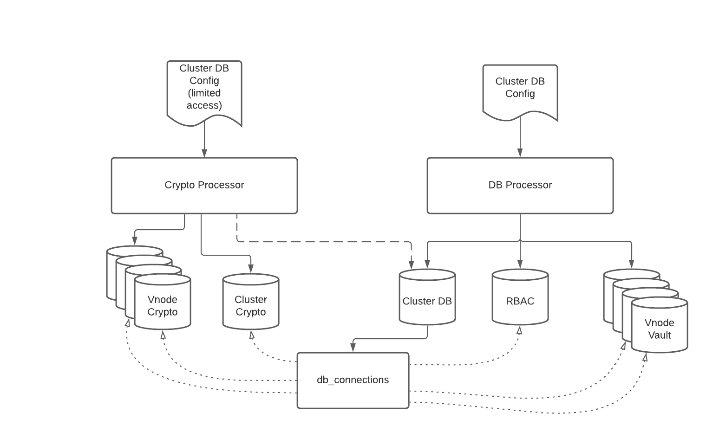

Corda 5 uses several databases, as shown in the diagram below.
This section describes how to interact with these databases from within Corda.



Databases in the diagram could be different physical DBs or DB hosts, or they could be logical parts of the "main" DB, separated by schemas, for example. Corda however always treats them as separate DBs that have their own DB configuration.

There are 2 types of databases:

- static — cluster db, rbac db, cluster crypto db. These are a fixed set of DBs created as part of installing the corda cluster and do not change at runtime.
- dynamic — vnode vault and vnode crypto DBs. These are specific to a virtual node hosted on the cluster. New nodes can be added to the cluster at runtime as new VNodes are being onboarded.

# Corda Cluster DB

The corda cluster DB is the _main_ DB, managing configuration for the cluster itself. Credentials needed to access this DB are always passed in as start-up parameters to the workers & processors (DB Processor and Crypto Processor).
One of the tables in this database is the `db_connection` table, which contains DB configuration for the other databases in the cluster.

Connections are identified by their `name` (e.g `corda-rbac`), and `privilege` (`DDL` or `DML`).

# DB Connection Manager

The `DbConnectionManager` is a singleton component that provides an interface to fetch `EntityManagerFactory` objects for a given DB.
It must be initialized with the cluster DB configuration so that it can fetch other DB configurations from the cluster DB. This means this component must be bootstrapped early on in the Processor lifecycle and any components that are dependent on a DB connection cannot start until this initialisation is complete.

The `DbConnectionManager` provides 2 methods to fetch an `EntityManagerFactory` as well as a method to be able to save a new DB configuration.

## Getting an EntityManagerFactory for a _static_ DB

`EntityManagerFactory` for _static_ DBs can be fetched using the following function of the `DbConnectionManager`:

```kotlin
fun getOrCreateEntityManagerFactory(db: CordaDb, privilege: DbPrivilege): EntityManagerFactory
```

To create an `EntityManagerFactory` you must know the JPA annotated entities that `EntityManager`s created from this factory will manage. A `JpaEntitiesRegistry` allows us to specify the classes that are related to a given `CordaDb`. 
This is usually performed in the DB Processor.
For example:

```kotlin
entitiesRegistry.register(CordaDb.RBAC.persistenceUnitName, RbacEntities.classes)
```

## Getting an EntityManagerFactory for a _dynamic_ DB

`EntityManagerFactory` for _dynamic_ DBs can fetched using the following function of the `DbConnectionManager`:

```kotlin
fun getOrCreateEntityManagerFactory(name: String, privilege: DbPrivilege, entitiesSet: JpaEntitiesSet):
            EntityManagerFactory
```

In this case, you must specify the name as a string (e.g. `vnode_vault_<holding-id-hash>`) and the database stores this name in the VNode configration table.
This method also needs an `JpaEntitiesSet`. This could be one fetched from the `JpaEntitiesRegistry` for schemas that are "well known" (e.g. VNode Crypto DB), or it could be dynamic in case of VNode custom schemas. If the `JpaEntitiesSet` is dyanmic, the classes need to be in the correct classloader, which may be the DB Sandbox. 

## Saving connection details

In the case of VNodes, you must save new DB connection details at runtime using the following function:

```kotlin
fun putConnection(
        name: String,
        privilege: DbPrivilege,
        config: SmartConfig,
        description: String?,
        updateActor: String)
```

You can provide the DB connection details either as part of the VNode onboarding, in which case the DB is "managed" outside of Corda, or Corda can create a new "logical" DB inside the cluster DB using an implementation of `DbAdmin`.
Currently there is only a _Postgres_ implementation, in the future other RMDBs will be added, or other implementations could interface with external managed services for provisioning DBs.
