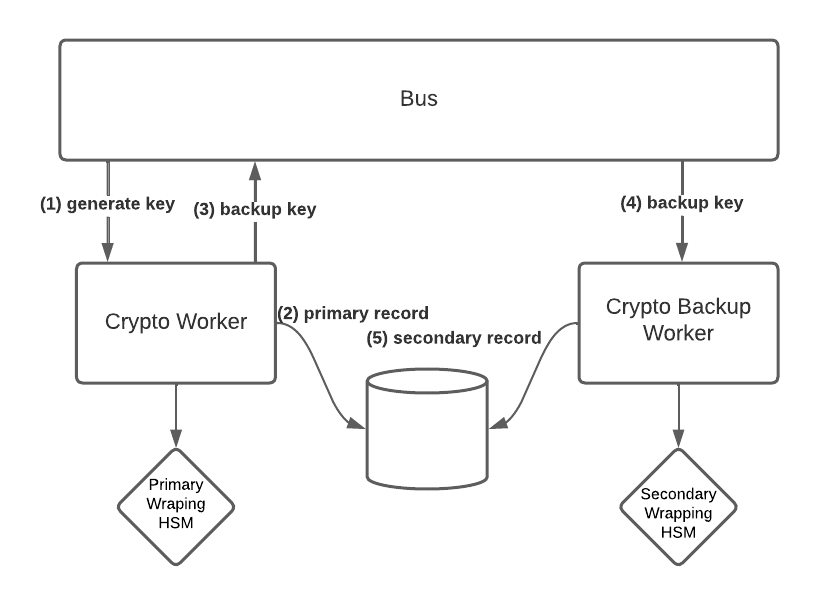
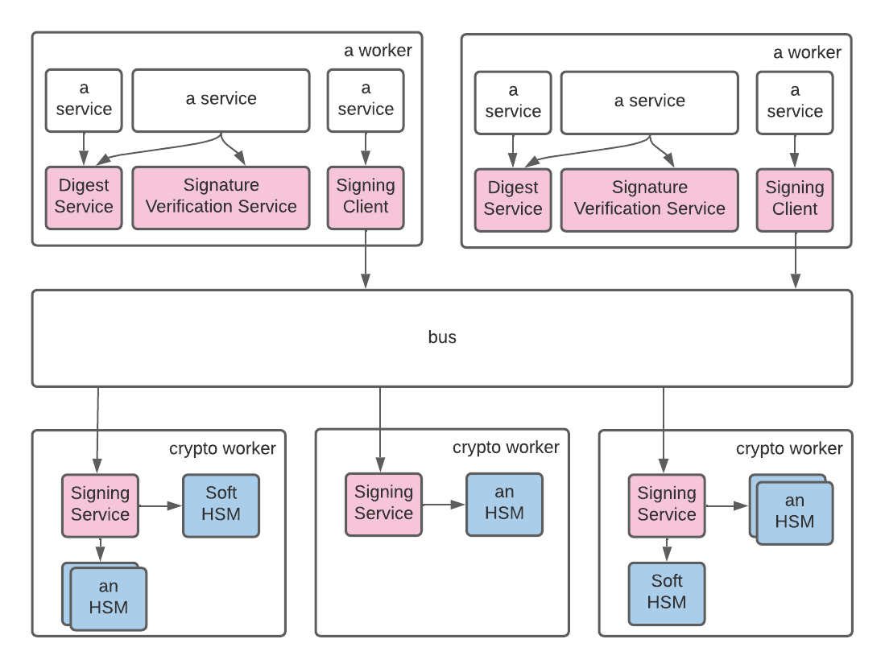
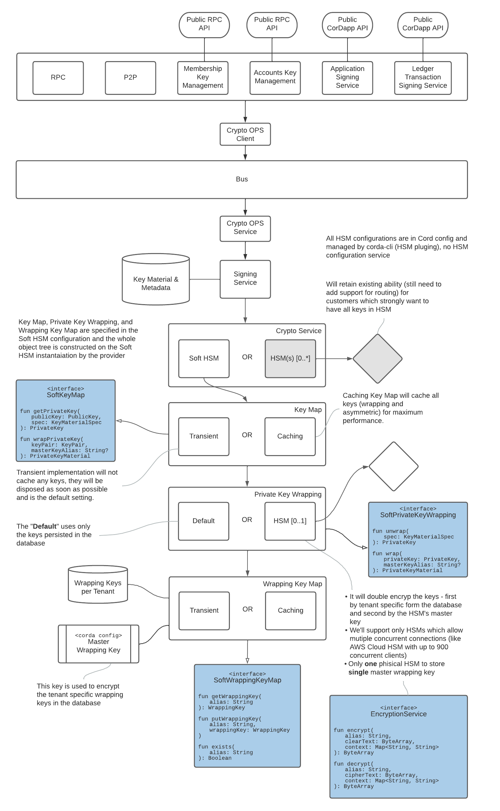
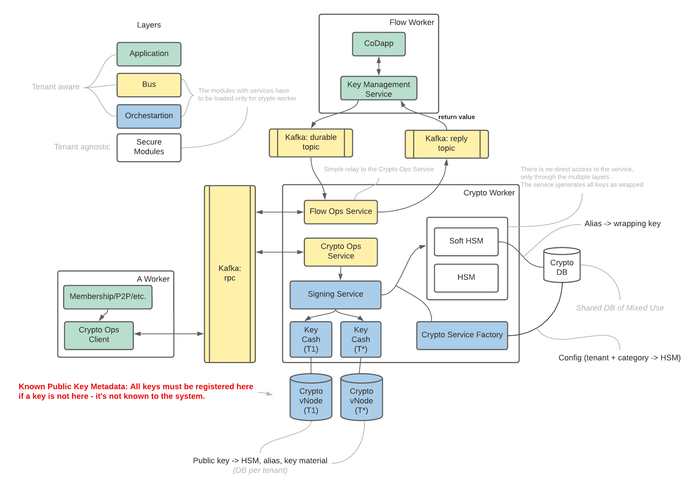
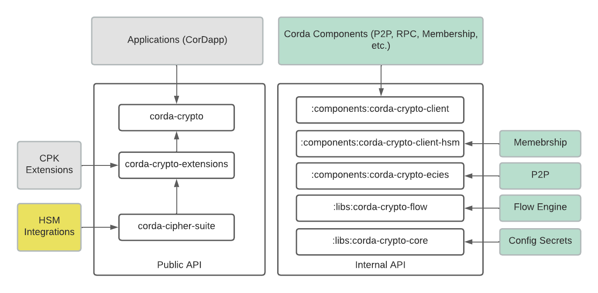
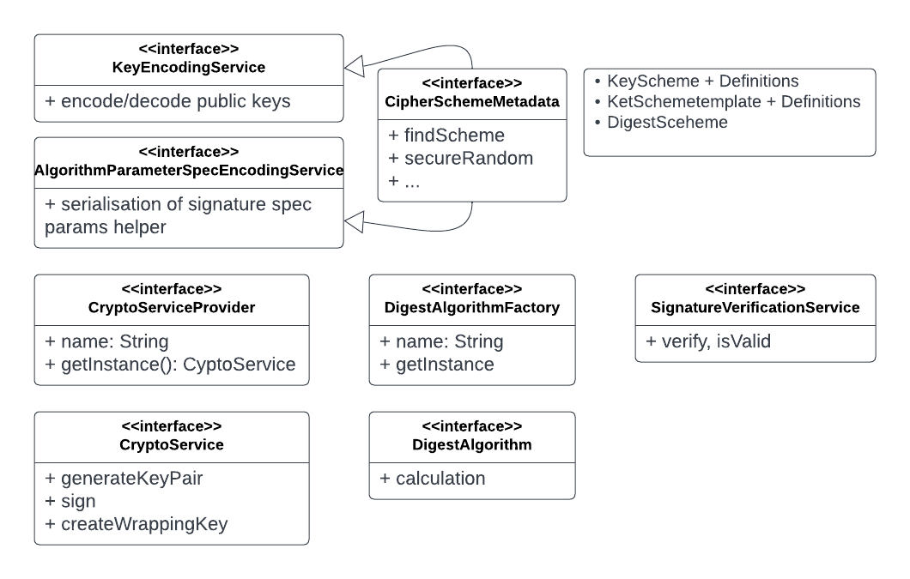
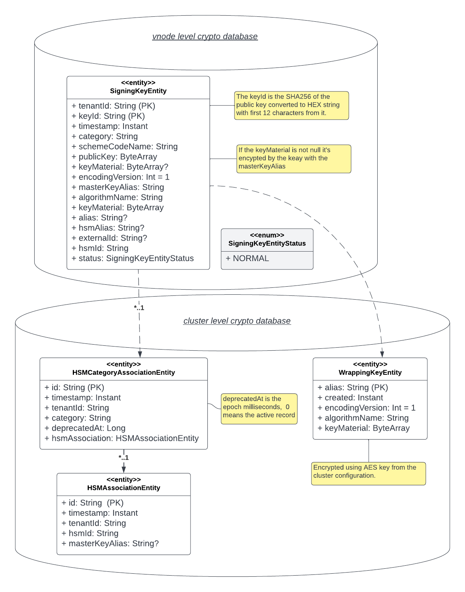

# Tenant
Corda 5 is a multi-tenanted system where the tenant is defined in terms of a member or vnode. However, the Crypto Library manages keys on behalf of members as well as the cluster itself. In the case of the members (notaries, network managers, etc.) the tenant is their vnode id but for the cluster it depends on the subsystem. There is a `CryptoTenants` object which provideds constants for the cluster level tenants.

| Tenant                                                       | Tenant Id        |
| ------------------------------------------------------------ | ---------------- |
| Network member (such as notary, network manager aka MGM, member) | Their VNODE id   |
| Cluster subsystems                                           | `p2p`, `rpc-api` |


# Assumptions and considerations
* An HSM has limited capacity. The number of keys that it can store is measured in few hundreds or in low thousands.
* Most HSM interface libraries/drivers assume that there is either  only one HSM instance per machine, like Utimaco, or per running process (like passing the location of the config files and drivers as environment variables, like AWS Cloud HSM), that require a dedicated crypto workers for such instances and involve some kind of message routing.
* Not all HSMs have the notion of partition. For those that have it, we treat partitions as separate instances of that HSM.
* As an instance of HSM can be shared between different tenants, we cannot accept key aliases directly from members due to high probability of a name clash.
* Support for the ability to store keys of different roles in different HSMs. For example, a Ledger key may be stored in an Utimaco HSM and the Session Initiating Key in Azure Key Vault.
* A tenant registers itself with each HSM category explicitly during the onboarding process.


## Tradeoffs Managing Cluster Setup Complexity and Security of Private Keys

### Crypto Worker Sets

To avoid configuring too many different variant of crypto worker (for each possible combination of HSM which is not possible) there will be a concept of a crypto worker set (where each differently configured crypto worker will be defined as a set) plus each set will handle ONLY one implementation of HSM be it the SOFT or any other hardware HSM.

By default we'll ship only one crypto worker set with the SOFT HSM configured in the "Standard" security level, see bellow for the details.

### Key Security Levels

As many HSM require additional setup steps or allow access only to a single device of the same make from the same host there will be three levels of the key security:

1. **Standard** which will use a AES wrapping keys per each tenant persisted in the database, those wrapping keys will be encrypted in turn using master AES key. provided as a Corda configuration secret. The encrypted private keys are persisted in the database.
2. **High** which will double encrypt the private keys using the wrapping keys as defined in the Standard level plus using an HSM for the second encryption pass. The encrypted private keys are still persisted in the database. _This level is for the majority of customers which want have high level protection but don't want the complexity of managing multiple crypto worker sets_.
3. **Ultimate** which will store all private keys in multiple HSMs, _this level is for the customers which require such protection and are **capable to cope with the complex** cluster setup and maintenance_.


The security and loss of service risks are defined only for the new High level of key security as others are existing and the risks for them are not changed. 

### Security Risks

The risks for the "**High**" level are that the JAVA key implemntations don't allow for their easy destruction and JVM in general doesn't prevent the process memory being swapped to the disk.

The **mitigation** is that the operations which expose the private keys in memory are done in dedicated worker which doesn't have any user code and can be secured on infrastructure level.

> Note that for the "**Standard**" level the risks are leass than in C4 due using the database isntead of the filed based key stores.

### Loss of Service Risks

Previously (or in the "**Ultimate**" level) if an HSM is lost that would lead to the loss of a few keys however in the proposed implementation the loss of the Wrapping HSM will lead to loss of all keys in the "**High**" level.

As the **mitigation** we will implement asynchronous key backup in secondary HSM so the possible loss of the keys would be minimal if the primary HSM is lost before the key being backed up. The solution is Hot-Cold as the workers will have to be reconfigured (in some cases rebuilt) to use secondary HSM when the primary is lost. You would need such backup when you require very high avaiability guarantees even in case of AWS CloudHSM as it's not geographically redundant only in different avaialbility zones (all nodes are in the same datacenter).



### QA Complexity Risk

Testing crypto operations which rely on HSM is historcally prooven in C4 ecounter high level efforts due the complexities of setting up. C5 will make it even harder as special instances of the crypto worker for each HSM must be prepared.

The advise would be to allow the C5 platform ability to support mutiple HSMs but implement integrations with HSM as part of the professional services. 


# Overview
The library has two groups of operations:
* Sensitive — implemented in a separate crypto worker (divided into crypto worker sets), which does not run end user customizable code and is accessible only through a message bus. Note that the Crypto Library enables clients to invoke those operations so there is no need to work with the message bus directly:
  * Key generation
  * Signing
  * HSM assignments
  * Key lookups
* Generic crypto operations — the services are residing directly in the consuming processes:
  * Calculating digests
  * Signature verification
  * Providing metadata about public keys and digests, like algorithm



## Categories

To enable different HSMs depending on key roles for the same tenant, there is a notion of the HSM category (or just a category) which roughly corresponds to key roles. Some of the categories are:
* ACCOUNTS
* CI
* LEDGER
* TLS
* JWT_KEY
* NOTARY


## Layered View




The low-level crypto service implementations (the Secure Modules layer) is tenant agnostic (like most of HSM) so access to the keys is partitioned using the tenant id by the higher API level. 

The main idea behind layering is that the Crypto Library provides a basis for building specialized services on top of it, which in some cases are responsible only for the correct formatting of the requests to the Crypto Library (but not limited to that as in some case those services would need to have their own persistence, for example) - Accounts, Ledger Transactions, etc.


## Summary of Key Generation and Signing

The CorDapp and RPC API don't have direct access to the lower implementations as they are accessible only in the Crypto Worker.



* There will be several Kafka RPC topics for crypto operations (which require HSM) - one for each HSM (crypto worker set)
* The crypto worker configuration will have a parameter supplied as bootsrap parameters for HSM id which it handles
* Note that the above arrangmenet is only for operation requiring HSM, other operations such as HSM assignment are done conventionally - there is a single RPC topic to handle those requests.


## Crypto Library APIs



Public API:

| Module                  | Description                                                  |
| ----------------------- | ------------------------------------------------------------ |
| corda-crypto            | The module defines  basic crypto primitives (mostly used as return values or function arguments) available for CorDapps and services targeting CorDapps directly as well as definitions for the `DigestService` and `SignatureVerificationService`. |
| corda-cipher-suite      | The module defines  low level definitions that are required in order to implement integrations with various HSMs or extend capabilities of the Crypto Library. These definitions _must not be made available_ for CorDapp level APIs |
| corda-crypto-extensions | The module defines low-level services that can be used to extend functionality of the Corda Crypto Library by implementing them in a CPK. |


Internal API:

| Module                               | Description                                                  |
| ------------------------------------ | ------------------------------------------------------------ |
| :libs:crypto:crypto-core             | The module contains the most basic common crypto artifacts, like constants defining standardized categories, cluster level tenants, and AES support for secrets. |
| :libs:crypto:crypto-flow             | The module contains artifacts which are required to build crypto operation messages and process the results for the flows - `CryptoFlowOpsTransformer` |
| :components:crypto:crypto-client     | The module contains clients necessarily to  generate keys and sign - `CryptoOpsClient`,  (note that `CryptoOpsProxyClient` should not be used as that a relay client) |
| :components:crypto:crypto-client-hsm | The module contains clients necessarily to assign tenants - `HSMRegistrationClient` |
| :components:crypto:crypto-ecies      | The module contains clients necessarily to support ECIES for P2P - `EphemeralKeyPairEncryptor`, `StableKeyPairDecryptor` |


### Cipher Suite

The API (_corda-cipher-suite_) consists of low level artifacts that provide the asymmetric cryptography functionality for Corda. The main interfaces here are `CipherSchemeMetadata` which provides all required metadata about the suite and `CryptoService` which is the interface that has to be implemented for each supported HSM and provides the means to securely generate key pair and sign.




```kotlin
interface CryptoService {
    fun requiresWrappingKey(): Boolean

    fun supportedSchemes(): Array<SignatureScheme>

    fun createWrappingKey(
        masterKeyAlias: String,
        failIfExists: Boolean,
        context: Map<String, String>
    )

    fun generateKeyPair(
        spec: KeyGenerationSpec,
        context: Map<String, String>
    ): GeneratedKey

    fun sign(
        spec: SigningSpec,
        data: ByteArray,
        context: Map<String, String>
    ): ByteArray
}
```


The contexts for the key generation or signing contain at least one item (with the key 'tenantId') specifying on behalf of which tenant the operation is performed. The key generation context also has the 'category' item.

The key generation parameters are more like a hit and it is up to the HSM to decide how exactly the key will be generated - as internally to the HSM or exported as a wrapped key. **Note:** If the key has to be wrapped and the HSM needs to know the wrapping key, the corresponding HSM configuration should provide sufficient information about which master key alias should be used.

If the HSM will have to store the private key inside the HSM, it cannot use the provided parameter 'alias' directly as different tenants may choose the same value for that parameter. Instead the HSM must either randomly generate it or, ideally, use the tenant id, alias, and secret in order to calculate the actual alias in the deterministic way (using something like HMAC). The calculated alias must be returned as `hsmAlias` so it can be used in the signing operations later.


```kotlin
class KeyGenerationSpec(
    val signatureScheme: SignatureScheme,
    val alias: String?,
    val masterKeyAlias: String?
)

interface GeneratedKey {
    val publicKey: PublicKey
}

class GeneratedPublicKey(
    override val publicKey: PublicKey,
    val hsmAlias: String
) : GeneratedKey

class GeneratedWrappedKey(
    override val publicKey: PublicKey,
    val keyMaterial: ByteArray,
    val encodingVersion: Int
) : GeneratedKey
```


### Key Schemes and Signature Specs

```kotlin
data class KeyScheme(
    val codeName: String,
    val algorithmOIDs: List<AlgorithmIdentifier>,
    val providerName: String,
    val algorithmName: String,
    val algSpec: AlgorithmParameterSpec?,
    val keySize: Int?,
    val capabilities: Set<KeySchemeCapability>
)

enum class KeySchemeCapability {
    SIGN,
    SHARED_SECRET_DERIVATION
}

// defined in the corda-crypto module as that is publically visible to applications/CorDapp(s)
data class SignatureSpec(
    val signatureName: String,
    val params: AlgorithmParameterSpec? = null,
    val customDigestName: DigestAlgorithmName? = null
)
```

In Corda5 the key scheme is separated from the signature spec (_in Corda4 those parameters are tied together_).

As well there is now a key capability option which defines how the key can be used - for signing, ECDH key deriviation or both.

It's possible to specify that the digest should be precalculated before signing by specifying the `customDigestName` (not being part of the signing process itself) but that should be done carefully as that requires careful setting of the parameters.

| Key Scheme              | Capability   | Well Known Signature Algorithms                              |
| ----------------------- | ------------ | ------------------------------------------------------------ |
| CORDA.RSA               | Sign         | SHA256withRSA, SHA384withRSA, SHA512withRSA, RSASSA-PSS (MGF1,SHA-256), RSASSA-PSS (MGF1,SHA-384), RSASSA-PSS (MGF1,SHA-512) |
| CORDA.ECDSA.SECP256K1   | Sign, Derive | SHA256withECDSA, SHA384withECDSA, SHA512withECDSA            |
| CORDA.ECDSA.SECP256R1   | Sign, Derive | SHA256withECDSA, SHA384withECDSA, SHA512withECDSA            |
| CORDA.EDDSA.ED25519     | Sign         | EdDSA for  (note that the digest calculation is part of the signing algorithm itself) |
| CORDA.X25519            | Derive       | EdDSA for ECDH                                               |
| CORDA.SPHINCS-256       | Sign         | SHA512withSPHINCS256                                         |
| CORDA.SM2               | Sign, Derive | SM3withSM2, SHA256withSM2                                    |
| CORDA.GOST3410.GOST3411 | Sign         | GOST3411withGOST3410                                         |


# Persistence and Configuration

## Database Persistence Models



The main key entity is the `SigningKeyEntity`, which stores information about a know key pair. All known key pairs must be recorded in the corresponding table. The record (entity) stores the public key of the pair, metadata about the pair, and the encrypted private key if the key was wrapped and exported from HSM (note that the private key is still not available outside of such HSM as it's encrypted before exporting using the wrapping key). If the key is not in that table, it means the key is not known as there is no alternative way of configuring or discovering key pairs.

The `WrappingKeyEntity` is used by the SOFT HSM to persist tenant's wrapping keys which in turn are encrypte by a single master wrapping supplied as confoguration secret.

`HSMCategoryAssociationEntity` and `HSMAssociationEntity`define hierarchical association of a tenant and the key category with HSM which handles the keys of that category. The hierarchy is required to minimised number of wrapping keys as they are generated per-tenant rather tahn tenant plus category.


## Crypto Worker Set and HSM Configuration

The crypto worker configuration will contain an id of the HSM which it handles as well as the complete map of all HSMs with their configuration.

Each HSM device (and for HSMs which have a notion of independent partitions - each partition)  must have a separate configuration entry in the configuration's HSM map.

Bellow is the example of the configuration:

```javascript
{
    "cryptoConnectionFactory": {
        "expireAfterAccessMins": 5,
        "maximumSize": 3
    },
    "signingService": {
        "cache": {
            "expireAfterAccessMins": 60,
            "maximumSize": 1000
        }
    },
    "hsmService": {
        "cache": {
            "expireAfterAccessMins": 5,
            "maximumSize": 10
        },
        "downstreamMaxAttempts": 3
    },
    "hsmId": "SOFT",
    "hsmMap": {
        "SOFT": {
            "workerSuffix": "",
            "retry": {
                "maxAttempts": 3,
                "attemptTimeoutMills": 20000
            },
            "hsm": {
                "name": "SOFT",
                "categories": [
                    {
                        "category": "*",
                        "policy": "WRAPPED"
                    }
                ],
                "masterKeyPolicy": "UNIQUE",
                "capacity": "-1",
                "supportedSchemes": [
                    "CORDA.RSA",
                    "CORDA.ECDSA.SECP256R1",
                    "CORDA.ECDSA.SECP256K1",
                    "CORDA.EDDSA.ED25519",
                    "CORDA.X25519",
                    "CORDA.SM2",
                    "CORDA.GOST3410.GOST3411",
                    "CORDA.SPHINCS-256"
                ],
                "cfg": {
                    "keyMap": {
                        "name": "CACHING",
                        "cache": {
                            "expireAfterAccessMins": 60,
                            "maximumSize": 1000
                        }
                    },
                    "wrappingKeyMap": {
                        "name": "CACHING",
                        "salt": "<plain-text-value>",
                        "passphrase": {
                            "configSecret": {
                                "encryptedSecret": "<encrypted-value>"
                            }
                        },
                        "cache": {
                            "expireAfterAccessMins": 60,
                            "maximumSize": 100
                        }
                    },
                    "wrapping": {
                        "name": "DEFAULT",
                        "hsm": {
                            "name": "..",
                            "config": {}
                        }
                    }
                }
            }
        },
        "AWS": {
            "retry": {
                "maxAttempts": 3,
                "attemptTimeoutMills": 20000
            },
            "hsm": {
                "name": "AWS",
                "categories": [
                    {
                        "category": "ACCOUNTS",
                        "policy": "WRAPPED"
                    },
                    {
                        "category": "CI",
                        "policy": "WRAPPED"
                    },
                    {
                        "category": "*",
                        "policy": "ALIASED"
                    }
                ],
                "masterKeyPolicy": "SHARED",
                "masterKeyAlias": "cordawrappingkey",
                "capacity": "3300",
                "supportedSchemes": [
                    "CORDA.RSA",
                    "CORDA.ECDSA.SECP256R1",
                    "CORDA.ECDSA.SECP256K1",
                    "CORDA.X25519"
                ],
                "config": {
                    "username": "user",
                    "passphrase": {
                        "configSecret": {
                            "encryptedSecret": "<encrypted-value>"
                        }
                    },
                    "partition": "whatever"
                }
            }
        },
        "bus": {
            "processors": {
                "ops": {
                    "maxAttempts": 3,
                    "waitBetweenMills": [
                        200
                    ]
                },
                "flow": {
                    "maxAttempts": 3,
                    "waitBetweenMills": [
                        200
                    ]
                },
                "config": {
                    "maxAttempts": 3,
                    "waitBetweenMills": [
                        200
                    ]
                },
                "registration": {
                    "maxAttempts": 3,
                    "waitBetweenMills": [
                        200
                    ]
                }
            }
        }
    }
}
```


## Finding assigned HSM for a crypto operation

The lookup for an associated HSM is done by the tenant id and the category (note that the deprecatedAt must be 0 for the association which links tenant/category and the HSM)


# HSM and Tenants

Before any tenant, either cluster level or vnode, can use any secure crypto operation requiring an HSM (key generation and signing), it must be associated with an HSM for each category. 

The association is done in a semi-automatic way - the tenant can pick whenever they want to use the SOFT HSM or any real HSM provided by the cluster operator. 

If the tenant chooses to use real HSM, it does not control which HSM will be assigned to it. The tenant can only provide some criteria such as the category, that the HSM must store only aliased keys (hosted by HSM without the ability to export them), or that it supports specific key schemes.

