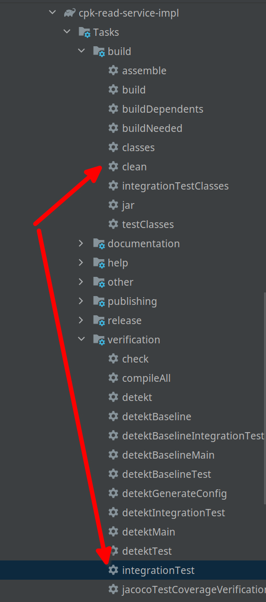
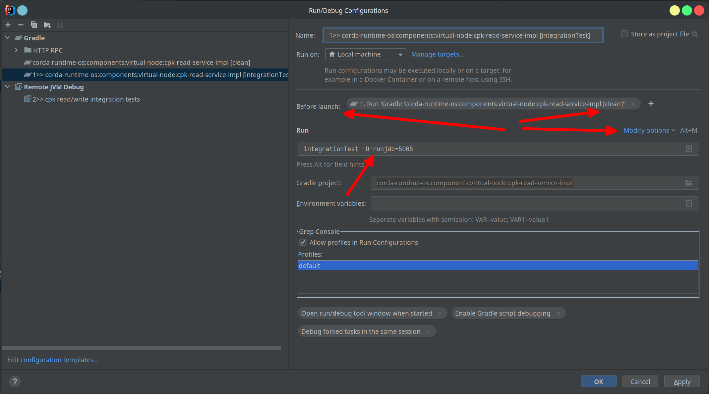
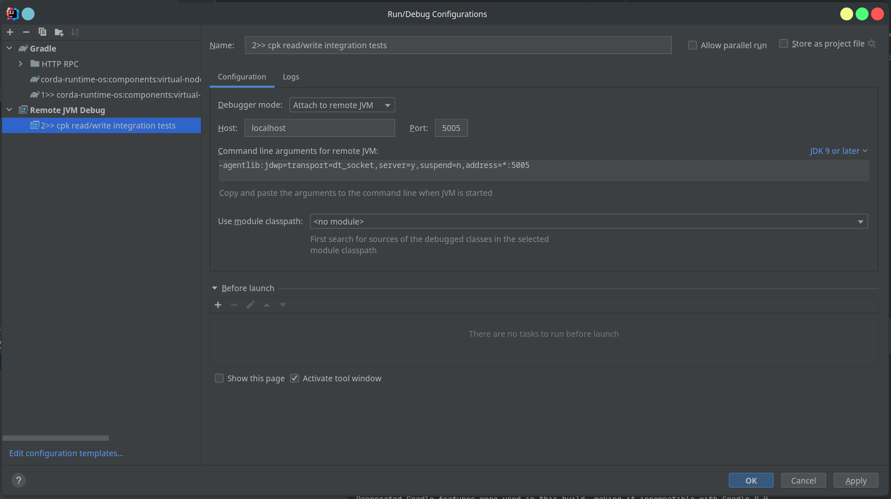

# Debugging integration tests using jdb

To debug integration tests with jdb:

1. Locate and run both the `clean` and `integrationTest` tasks:

   

2. Edit the `integrationTest` configuration to run the `clean` task before launch. Select `Modify options` then `Before Launch`, then hit '+" then select `Run gradle task`. Append `-D-runjdb=5005` to the run line:

   

3. Create a "Remote JVM Debug" configuration, ensuring the port matches the one used
previously, i.e. `5005`

   

4. Run the `integrationTest` task. 
   
   Once it starts, it pauses and waits.

5 Run the `Remote JVM Debug` task to connect. 

   You can now debug into the integration test.

For step 5 you may alternatively use the "Attack debugger" tooltip in IntelliJ


# Debugging integration tests with Postgres

To debug a set of integration tests with Postgres:

1. Locate the `integrationTest` that you intend to run in Intellij.

2. Run `integrationTest` to create the run/debug configuration.

3. Run the Docker postgres image in a console:

   ```shell
   docker run --rm --name test-instance -e POSTGRES_PASSWORD=password -p 5432:5432 
   postgres
   ```

4. In your Intellij run/debug configuration add `-PpostgresPort=5432`  (**Note:** not `-D`):

   
